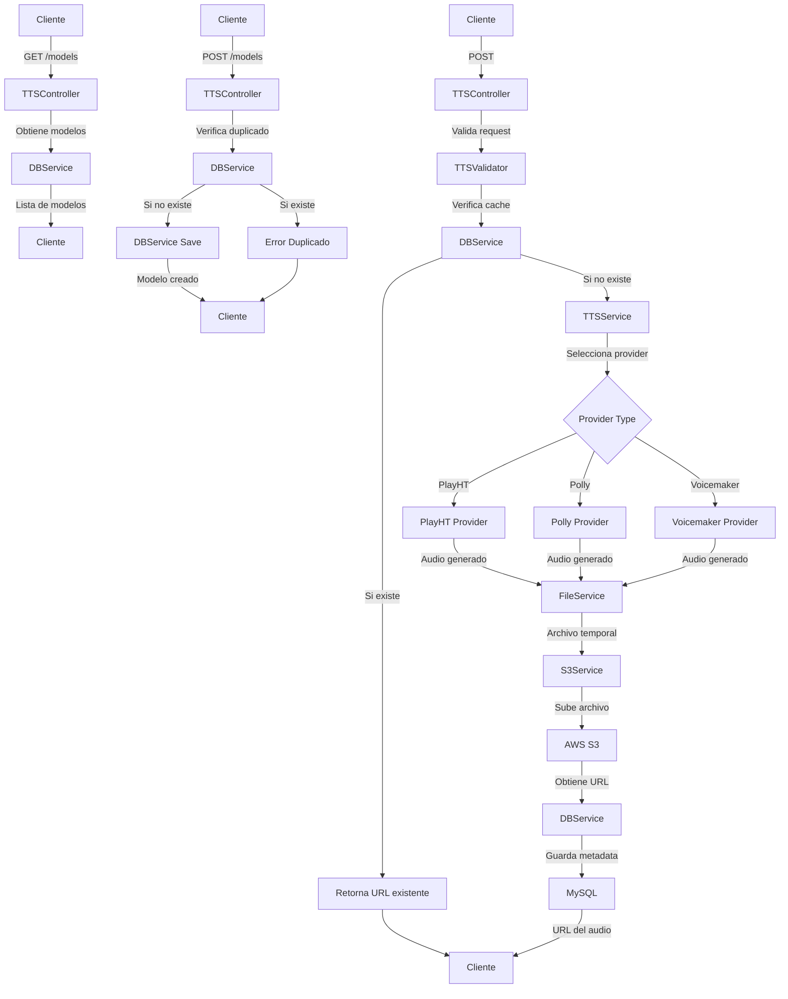

# Servicio de Text-to-Speech (TTS)


## Descripción

Servicio API REST construido con FastAPI que convierte texto a voz utilizando el servicios en linea. El sistema implementa cacheo de audios, almacenamiento en AWS S3 y registro en base de datos MySQL.

## Características Principales

-   Conversión de texto a voz mediante TTS online
-   Soporte multiidioma (Inglés y Español)
-   Voces masculinas y femeninas
-   Almacenamiento en AWS S3
-   Cacheo de audios generados
-   Base de datos MySQL para metadata
-   Configuración mediante archivos YAML

## Requerimientos
-   Python >= 3.9 < 3.12
-   MySQL
-   Cuenta AWS (S3)
-   Cuenta Play.ht
-   Cuenta Voicemaker.in

## Instalación y Uso

### 1. Usando Docker (Recomendado)

1. Crea un archivo .env con las siguientes variables (o descarga el ejemplo):
```.env
# API Credentials
VOICEMAKER_BEARER=Bearer xxxxx-xxxx-xxxx-xxxx-xxxxxxxxxxxx
PLAYHT_API_USER_ID=your_user_id
PLAYHT_API_AUTH_TOKEN=your_auth_token

# AWS Credentials
AWS_ACCESS_KEY=your_access_key
AWS_SECRET_KEY=your_secret_key
AWS_REGION=your_region
AWS_BUCKET=your_bucket
AWS_URL=your_s3_url

# Database Credentials
DB_HOST=your_host
DB_USER=your_user
DB_PASSWORD=your_password
DB_NAME=your_database 

# CORS Settings (comma-separated URLs)
CORS_ORIGINS=["http://localhost:3000","http://localhost:5500","http://127.0.0.1:5500"]
```

2. Crea la tabla en tu base de datos MySQL:
```sql
CREATE TABLE generated_audios (
    id INT AUTO_INCREMENT PRIMARY KEY,
    original_text TEXT,
    input_text TEXT NOT NULL,
    information_id INT DEFAULT NULL,
    file_url VARCHAR(255) NOT NULL,
    audio_hash VARCHAR(64) NOT NULL UNIQUE,
    created_at TIMESTAMP DEFAULT CURRENT_TIMESTAMP
);

CREATE TABLE information_audios (
  id INT AUTO_INCREMENT PRIMARY KEY,
  voice_name VARCHAR(255) NOT NULL,
  `language` VARCHAR(45) NOT NULL,
  gender ENUM('M','F') NOT NULL,
  `type` ENUM('robot','adult','child') NOT NULL,
  platform VARCHAR(45) DEFAULT NULL,
  model VARCHAR(500) NOT NULL,  
);
```

3. Puedes ejecutar el servicio de dos formas:

#### Opción A: Usando Docker directamente
```bash
docker pull cristianmaringma/tts-service:latest
docker run -p 8000:8000 --env-file .env cristianmaringma/tts-service:latest
```

#### Opción B: Usando Docker Compose
1. Crea un archivo docker-compose.yml:
```yaml
services:
  tts-service:
    image: cristianmaringma/tts-service:latest
    ports:
      - "8000:8000"
    env_file:
      - .env
```

2. Inicia el servicio:
```bash
docker-compose up -d
```

### 2. Instalación Local (Para Desarrollo)

1. Clona el repositorio:
```bash
git clone https://github.com/ccmarin14/TTS-Service.git
```

2. Crea y configura tu archivo .env:
```bash
cp .env.example .env
# Edita .env con tus credenciales
```

3. Inicia el servicio:
```bash
docker-compose up -d
```

## Estructura del Proyecto
```
/TTS-Service
├── app/
│   ├── controllers/
│   │   └── tts_controller.py     # Endpoints de la API
│   ├── models/
│   │   ├── tts_model.py          # Modelos para requests TTS
│   │   └── information_model.py  # Modelos para voces
│   ├── providers/                # Proveedores TTS
│   │   ├── base.py               # Clase base para providers
│   │   ├── playht.py             # Proveedor Play.ht
│   │   ├── polly.py              # Proveedor Amazon Polly
│   │   └── voicemaker.py         # Proveedor Voicemaker
│   ├── resources/                # Recursos
│   │   └── audios                # Carpeta temporal de audios
│   ├── services/
│   │   ├── container_service.py  # Contenedor de servicios
│   │   ├── database/
│   │   │   ├── db_service.py     # Operaciones con MySQL
│   │   │   └── query_service.py  # Organizador de consultas
│   │   ├── storage/
│   │   │   ├── file_service.py   # Gestión de archivos
│   │   │   └── s3_service.py     # Integración con AWS S3
│   │   ├── tts/
│   │   │   └── tts_service.py    # Servicio principal TTS
│   │   └── container_service.py  # Servicio para agrupar los servicios
│   ├── utils/
│   │   └── yaml_loader.py        # Utilidad para YAML
│   ├── validators/
│   │   └── tts_validator.py      # Validación de requests
│   ├── main.py                   # Inicialización de FastAPI
│   └── static_files.py           # Montaje de la carpeta de recursos
├── config.yaml                   # Configuración general
└── requirements.txt              # Dependencias del proyecto
```

## Uso de la API
### Convertir Texto a Voz

## Uso de la API

### 1. Convertir Texto a Voz por Nombre
```bash
POST /tts/by-name/
```
#### Payload:
```json
{
  "text": "Texto original a convertir",
  "read": "Texto que se leerá",
  "language": "es-ES",
  "model": "Carmen"
}
```

### 2. Convertir Texto a Voz por ID
```bash
POST /tts/{model_id}
```
#### Payload:
```json
{
  "text": "Texto original a convertir",
  "read": "Texto que se leerá"
}
```

### 3. Convertir Texto con Parámetros Opcionales
```bash
POST /tts/optional/
```
#### Payload:
```json
{
  "text": "Texto original a convertir",
  "read": "Texto que se leerá",
  "language": "es-ES",
  "gender": "F",
  "type": "adult"
}
```

### 4. Crear Nuevo Modelo de Voz
```bash
POST /models/
```
#### Payload:
```json
{
  "voice_name": "Nueva Voz",
  "language": "es-ES",
  "gender": "F",
  "type": "adult",
  "platform": "polly",
  "model": "Lucia"
}
```

### 5. Obtener Modelos Disponibles
```bash
GET /models/
```
#### Respuesta:
```json
{
  "playht": {
    "es-ES": {
      "adult": {
        "F": [
          {
            "id": 1,
            "voice_name": "Carmen",
            "model": "s3://voice-cloning-zero-shot/d9ff78ba-d016"
          }
        ]
      }
    }
  },
  "polly": {
    "es-ES": {
      "adult": {
        "F": [
          {
            "id": 2,
            "voice_name": "Lucia",
            "model": "Lucia"
          }
        ]
      }
    }
  }
}
```

### Respuesta Exitosa (para endpoints TTS):
```json
{
  "message": "Audio sintentizado correctamente",
  "audio_path": "https://tu-bucket.s3.amazonaws.com/audios/hash.mp3"
}
```

### Errores Comunes:
```json
{
  "detail": "Información no encontrada para el lenguage:'es-ES' y para el nombre del modelo:'ModeloX'"
}
```

```json
{
  "detail": "El campo texto no puede estar vacío"
}
```

```json
{
  "detail": "Ya existe un modelo con el nombre: NuevaVoz"
}
```

## Flujo de la aplicación


## Versiones Disponibles
- `latest`: Última versión estable
- `1.0.0`: Primera versión estable
- `2.0.0`: Segunda versión estable que permite trabajar con multiples TTS en línea

## Mantenimiento
### Actualización de la Imagen
Para actualizar a la última versión:
```bash
docker pull cristianmaringma/tts-service:latest
```

### Logs y Monitoreo
```bash
# Ver logs del contenedor
docker logs tts-service

# Ver estadísticas de uso
docker stats tts-service
```

## Documentación API
-   Swagger UI: http://localhost:8000/docs
-   ReDoc: http://localhost:8000/redoc

## Soporte
Si encuentras algún problema o tienes alguna sugerencia, por favor:
1. Revisa los issues existentes en GitHub
2. Abre un nuevo issue si es necesario
3. Contacta al equipo de mantenimiento

## Licencia
©2025, GMA Digital - Todos los derechos reservados.