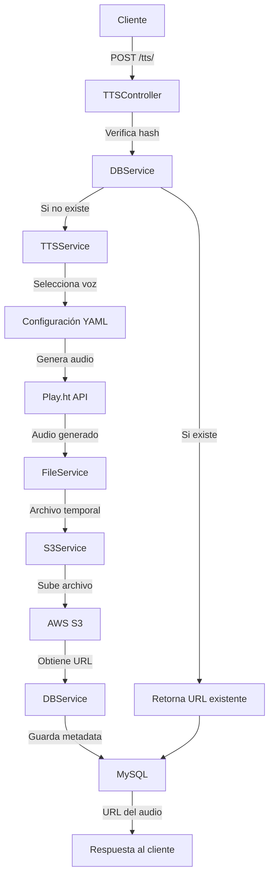
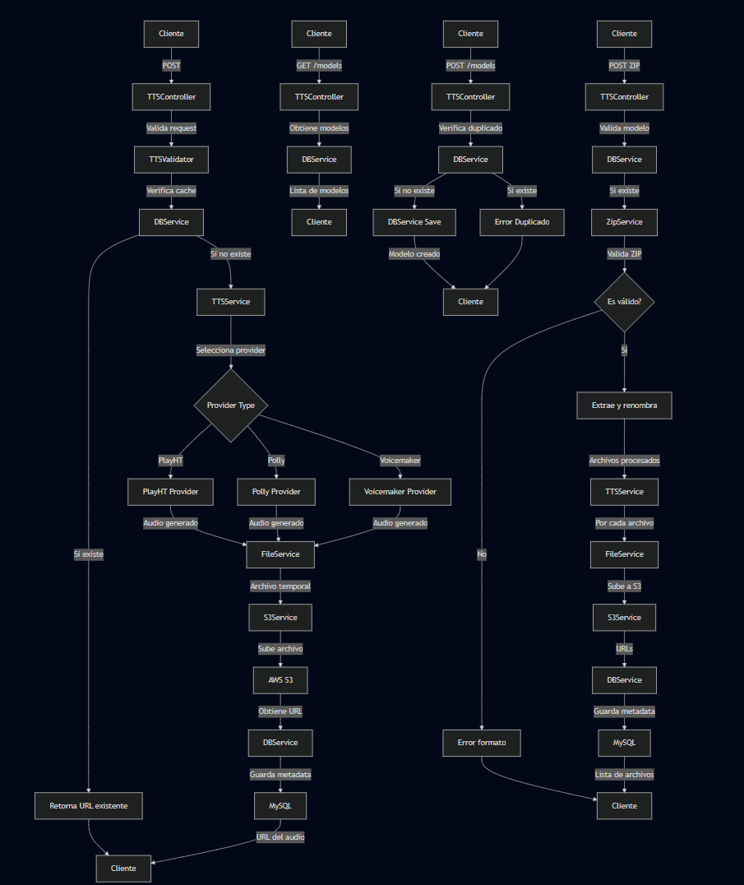

# Servicio de Text-to-Speech (TTS)


## Descripción

Servicio API REST construido con FastAPI que convierte texto a voz utilizando el servicio Play.ht. El sistema implementa cacheo de audios, almacenamiento en AWS S3 y registro en base de datos MySQL.

## Características Principales

-   Conversión de texto a voz mediante Play.ht API
-   Soporte multiidioma (Inglés y Español)
-   Voces masculinas y femeninas
-   Almacenamiento en AWS S3
-   Cacheo de audios generados
-   Base de datos MySQL para metadata
-   Configuración mediante archivos YAML

## Requerimientos
-   Python >= 3.9 < 3.12
-   MySQL
-   Cuenta AWS (S3)
-   Cuenta Play.ht

## Instalación y Uso

### 1. Usando Docker (Recomendado)

#### Método Rápido
```bash
docker pull tuusuario/tts-service:latest
docker run -p 8000:8000 --env-file .env tuusuario/tts-service:latest
```

#### Usando Docker Compose
1. Crea un archivo docker-compose.yml:
```yaml
services:
  tts-service:
    image: tuusuario/tts-service:latest
    ports:
      - "8000:8000"
    env_file:
      - .env
```

2. Crea y configura tu archivo .env:
```bash
cp .env.example .env
# Edita .env con tus credenciales
```

3. Inicia el servicio:
```bash
docker-compose up -d
```

### 2. Instalación Local (Para Desarrollo)

1. Clona el repositorio:
```bash
git clone https://github.com/ccmarin14/TTS-Service.git
```

2. Crea y configura tu archivo .env:
```bash
cp .env.example .env
# Edita .env con tus credenciales
```

3. Inicia el servicio:
```bash
docker-compose up -d
```

## Configuración

El servicio requiere las siguientes variables de entorno en tu archivo .env:

```yaml
# API Credentials
API_USER_ID=your_user_id
API_AUTH_TOKEN=your_auth_token

# AWS Credentials
AWS_ACCESS_KEY=your_access_key
AWS_SECRET_KEY=your_secret_key
AWS_REGION=your_region
AWS_BUCKET=your_bucket
AWS_URL=your_s3_url

# Database Credentials
DB_HOST=your_host
DB_USER=your_user
DB_PASSWORD=your_password
DB_NAME=your_database

# CORS Settings (comma-separated URLs)
CORS_ORIGINS=["http://localhost:3000","http://localhost:5500","http://127.0.0.1:5500"]
``` 

## Estructura del Proyecto

```
/TTS-Service
├── app/
│   ├── controllers/
│   │   └── tts_controller.py     # Endpoints de la API
│   ├── models/
│   │   └── tts_model.py         # Modelos de datos
│   ├── services/
│   │   ├── tts_service.py       # Lógica principal de TTS
│   │   ├── file_service.py      # Gestión de archivos
│   │   ├── s3_service.py        # Integración con AWS S3
│   │   └── db_service.py        # Operaciones con MySQL
│   ├── data/
│   │   └── voices_config.yaml   # Configuración de voces
│   └── main.py                  # Inicialización de FastAPI
├── config.yaml                  # Configuración general
└── requirements.txt            # Dependencias del proyecto
```

## Uso de la API

### Convertir Texto a Voz

```bash
POST /tts/
```

### Payload:

```json
{
  "text": "Texto a convertir",
  "language": "Spanish",
  "gender": "F",
  "model": "Carmen"
}
```

### Respuesta:

```json
{
  "message": "Audio synthesized successfully",
  "audio_path": "https://tu-bucket.s3.amazonaws.com/bilinguismo/audios/hash.mp3"
}
```

### Obtener Modelos Disponibles

```bash
GET /models/
```

## Flujo de la aplicación





## Versiones Disponibles

- `latest`: Última versión estable
- `1.0.0`: Primera versión estable
- `1.0.0-alpine`: Versión ligera basada en Alpine Linux

## Mantenimiento

### Actualización de la Imagen

Para actualizar a la última versión:
```bash
docker pull tuusuario/tts-service:latest
```

### Logs y Monitoreo
```bash
# Ver logs del contenedor
docker logs tts-service

# Ver estadísticas de uso
docker stats tts-service
```

## Documentación API
-   Swagger UI: http://localhost:8000/docs
-   ReDoc: http://localhost:8000/redoc

## Soporte

Si encuentras algún problema o tienes alguna sugerencia, por favor:
1. Revisa los issues existentes en GitHub
2. Abre un nuevo issue si es necesario
3. Contacta al equipo de mantenimiento

## Licencia
©2024, GMA Digital - Todos los derechos reservados.